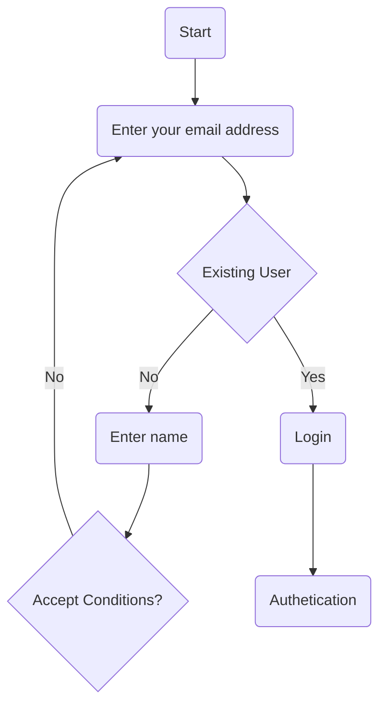

# Mermaid tutorial

Lets go!

```mermaid
flowchart
    S(Start) --> A;
    A(Enter your email address) --> B{Existing User};
    B -->|No| C(Enter name);
    C --> D{Accept Conditions?};
    D -->|No| A;

    B -->|Yes| E(Login);
    E --> F(Authetication);
```