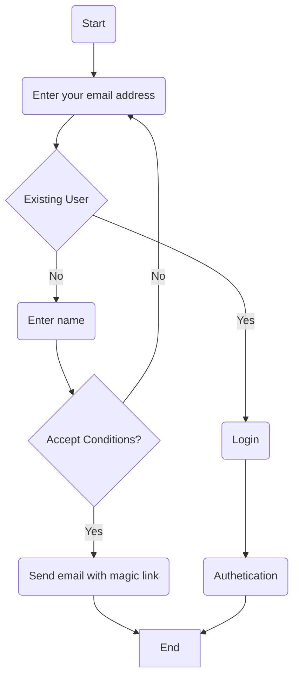

## Flowchart

```mermaid
flowchart 
    S(Start) --> A;
    A(Enter your email address) --> B{Existing User};
    B -->|No| C(Enter name);
    C --> D{Accept Conditions?};
    D -->|No| A;
    D -->|Yes| G(Send email with magic link)

    B -->|Yes| E(Login);
    E --> F(Authetication);

    G --> End;
    F --> End;
```
