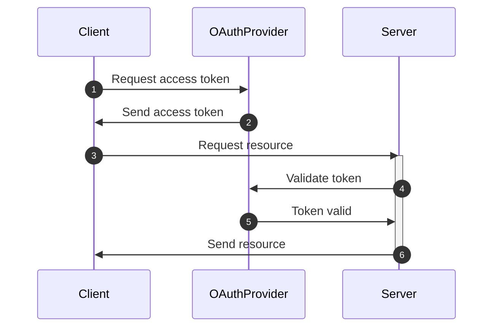

## Sequence

```mermaid
sequenceDiagram
    autonumber
    participant Client
    participant OAuthProvider
    participant Server

    Client ->> OAuthProvider: Request access token;

    OAuthProvider ->> Client: Send access token;

    Client ->> Server: Request resource; activate Server

    Server ->> OAuthProvider: Validate token;

    OAuthProvider ->> Server: Token valid;

    Server ->> Client: Send resource; deactivate Server
```